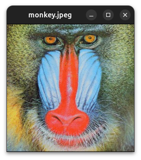
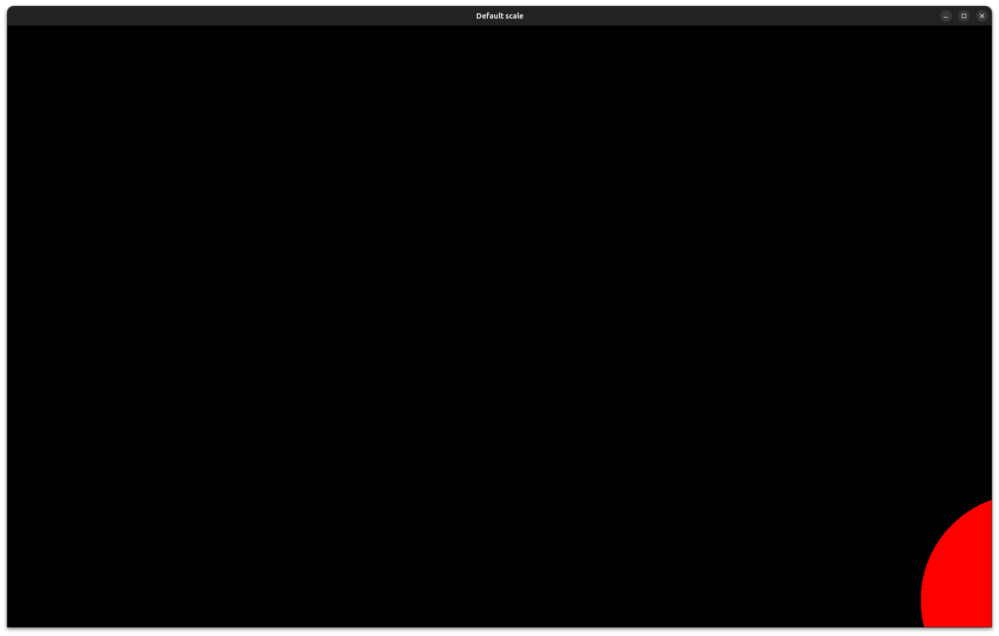
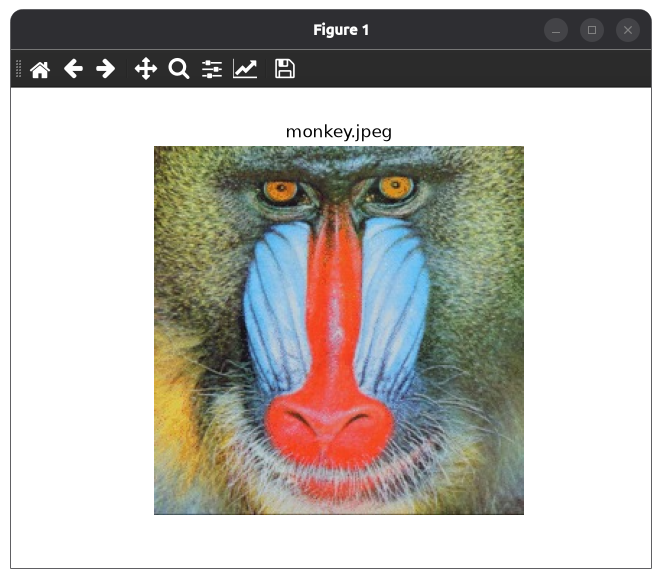

.. _tutorial-image-display:

================================================
Display an image
================================================

Introduction
===========================

Goal
---------------------------

In this tutorial you will learn how to:

- Display an image in a window.
- Use the :py:class:`~visp.core.Display` class.

Prerequisites
---------------------------

You should first read the :ref:`Getting started with images <tutorial-image-getting-started>` tutorial.

Display an image
===========================

Code
---------------------------

The following :ref:`example <code-image-display>` reads the ``monkey.jpeg`` file as an :py:class:`~visp.core.ImageRGBa` object and displays it:

.. literalinclude:: /examples/image/tutorial-image-display.py
  :language: python
  :linenos:

You can run the example with:

.. code-block:: bash

  python3 $VISP_WS/visp/modules/python/examples/image/tutorial-image-display.py

Result
---------------------------

The image is displayed in a window:

Click anywhere in the window to close it and allow the program to finish.

Explanation
---------------------------

We first import the classes required to read and use the image,
as well as the :py:class:`~visp.core.Display` class and the
:py:func:`~visp.python.display_utils.get_display` function:

.. literalinclude:: /examples/image/tutorial-image-display.py
  :language: python
  :end-before: # Image path

.. note::

  The :py:func:`~visp.python.display_utils.get_display` function
  detects the available GUI backend and returns a display object that can be
  used by the application. See the :py:class:`~visp.gui` class
  for more information.

We then import the image from the disk as the :py:class:`~visp.core.ImageRGBa` object I:

.. literalinclude:: /examples/image/tutorial-image-display.py
  :language: python
  :start-after: # Image path
  :end-before: # Create the display

.. note::

  For more information about reading and writing images, see the :ref:`Read an write an image file <tutorial-image-io>` tutorial.

Next, we create a :py:class:`~visp.core.Display` object d
using the :py:func:`~visp.python.display_utils.get_display` method, and initialize it with the dimensions of the image.
We then initialize it to the dimensions of the image we want to display,
and set the title of the display using :py:meth:`~visp.core.Display.setTitle`:

.. literalinclude:: /examples/image/tutorial-image-display.py
   :language: python
   :start-after: # Create the display
   :end-before: # Display the image

The image is then drawn in the display with the :py:class:`~visp.core.Display` method.
The :py:meth:`~visp.core.Display.flush` method finally shows the window on screen:

.. literalinclude:: /examples/image/tutorial-image-display.py
  :language: python
  :start-after: # Display the image
  :end-before: # Wait for user input

The :py:meth:`~visp.core.Display.flush` method does not stop the program execution.
We therefore call the :py:meth:`~visp.core.Display.getClick` method, to
pause the program until the user clicks in the display:

.. literalinclude:: /examples/image/tutorial-image-display.py
  :language: python
  :start-after: # Wait for user input

Other Options
===========================

Change scaling factor
---------------------

Depending on the image dimensions and your screen resolution, the display window
may be too large to fit on the screen.

The following :ref:`example <code-image-display-scaled-default>` creates a 2160 x 3840 image with a red circle in its center and displays it.
Run it with:

.. code-block:: bash

  python3 $VISP_WS/visp/modules/python/examples/image/tutorial-image-display-scaled-default.py

If your screen resolution is lower than the image resolution, the window may
not fit entirely on the screen. For example, the image below shows the result
on a 1920 x 1080 display:

To scale the image automatically so that it fits on the screen, call
:py:meth:`~visp.core.Display.setDownScalingFactor` method after initializing the display:

.. literalinclude:: /examples/image/tutorial-image-display-scaled-auto.py
  :language: python
  :start-after: # [downscaling-factor]
  :end-before: # [end-downscaling-factor]

You can test this behavior with the following :ref:`example <code-image-display-scaled-auto>`:

.. code-block:: bash

  python3 $VISP_WS/visp/modules/python/examples/image/tutorial-image-display-scaled-auto.py

You can also specify a fixed downscaling factor. For example, the following
code divides the image width and height by five:

.. literalinclude:: /examples/image/tutorial-image-display-scaled-manu.py
  :language: python
  :start-after: # [downscaling-factor]
  :end-before: # [end-downscaling-factor]

You can test this behavior with the following :ref:`example <code-image-display-scaled-manu>`:

.. code-block:: bash

  python3 $VISP_WS/visp/modules/python/examples/image/tutorial-image-display-scaled-manu.py

Display using Matplotlib
------------------------

.. note::

  This option requires the Matplotlib Python package.

You can also use Matplotlib to display the image. First, import
``matplotlib.pyplot``:

.. literalinclude:: /examples/image/tutorial-image-display-matplotlib.py
  :language: python
  :start-after: # [imports]
  :end-before: # [end-imports]

Then display the image in a figure:

.. literalinclude:: /examples/image/tutorial-image-display-matplotlib.py
  :language: python
  :start-after: # [display-image]
  :end-before: # [end-display-image]

The following :ref:`example <code-image-display-matplotlib>` shows this approach:

.. code-block:: bash

  python3 $VISP_WS/visp/modules/python/examples/image/tutorial-image-display-matplotlib.py

The result should look similar to this window:

Next Tutorial
===========================

You are now ready to learn how to :ref:`Read an write an image file <tutorial-image-io>`.