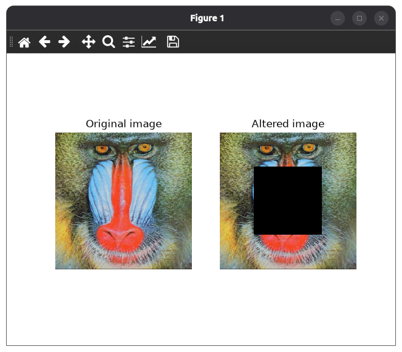
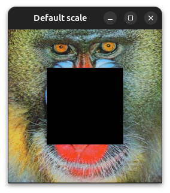
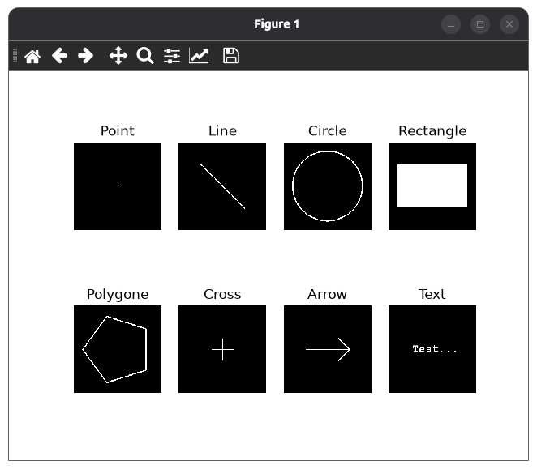

.. _tutorial-image-drawings:

=================================
Insert drawings in an image
=================================

Introduction
============

Goal
----

In this tutorial you will learn how to:

- Draw basic shapes on an image.
- Write text on an image.
- Display drawings as overlays.
- Use the :py:class:`~visp.core.ImageDraw`, :py:class:`~visp.core.Font`, and the figure classes.
- Use the :py:class:`~visp.core.Display` display methods.

Prerequisites
-------------

You should first read the
:ref:`Getting started with images <tutorial-image-getting-started>`
tutorial.

Draw a shape in an image
========================

Code
----

The following :ref:`example <code-image-drawings>` reads the ``monkey.jpeg`` image,
draws a filled black rectangle at its center, and displays the
original and modified images side by side.

.. literalinclude:: /examples/image/tutorial-image-drawings.py
  :language: python
  :linenos:

You can run the example with:

.. code-block:: bash

  python3 $VISP_WS/visp/modules/python/examples/image/tutorial-image-drawings.py

Result
------

The original image and the image with the black rectangle drawn on it are both displayed in a figure:

Explanation
-----------

We first import the classes required to read and manipulate an image:

.. literalinclude:: /examples/image/tutorial-image-drawings.py
  :language: python
  :end-at: from visp.core import ImageDraw, Rect, ImagePoint, Color

We then read the image ``monkey.jpeg``:

.. literalinclude:: /examples/image/tutorial-image-drawings.py
  :language: python
  :start-at: # Read the image
  :end-at:   sys.exit()

We create a :py:class:`~visp.core.Rect` object to define the rectangle's
position, width, and height. The rectangle's position is specified with an
:py:class:`~visp.core.ImagePoint`.

Then, we use :py:meth:`~visp.core.ImageDraw.drawRectangle` to draw a filled black
rectangle on the image:

.. literalinclude:: /examples/image/tutorial-image-drawings.py
  :language: python
  :start-at: # Insert a rectangle on the image
  :end-at: ImageDraw.drawRectangle(I2, rect, Color.black, True)

Finally, we display the original and modified images in a figure:

.. literalinclude:: /examples/image/tutorial-image-drawings.py
  :language: python
  :start-at: # Display the two images
  :end-at: plt.show()

Other options
=============

Display drawings as overlays
----------------------------

If you are using :py:class:`~visp.core.Display`, you can draw shapes and text as
overlays without modifying the underlying image. Use the corresponding
methods provided by :py:class:`~visp.core.Display`, such as
:py:meth:`~visp.core.Display.displayRectangle`.

For example, Using the code shown previously, but replacing the :py:meth:`~visp.core.ImageDraw.drawRectangle` by
:py:meth:`~visp.core.Display.displayRectangle`:

.. literalinclude:: /examples/image/tutorial-image-drawings-display.py
  :language: python
  :start-at: # Draw a rectangle on the display
  :end-at: Display.displayRectangle(I, rect, Color.black, True)

You obtain the following figure:

You can generate this figure yourself with this :ref:`example <code-image-drawings-display>`:

.. code-block:: bash

  python3 $VISP_WS/visp/modules/python/examples/image/tutorial-image-drawings-display.py

Draw Other shapes
------------

:py:class:`~visp.core.ImageDraw` provides methods for drawing several other
basic shapes.

You can see on this picture what some of these shapes looks like:

The image uses the following methods, in order:

- :py:meth:`~visp.core.ImageDraw.drawPoint`
- :py:meth:`~visp.core.ImageDraw.drawLine`
- :py:meth:`~visp.core.ImageDraw.drawCircle`
- :py:meth:`~visp.core.ImageDraw.drawRectangle`
- :py:meth:`~visp.core.ImageDraw.drawPolygon`
- :py:meth:`~visp.core.ImageDraw.drawCross`
- :py:meth:`~visp.core.ImageDraw.drawArrow`

The last image features text, wich is explained in the next section.

You can generate this figure yourself with this :ref:`example <code-image-drawings-shapes>`:

.. code-block:: bash

  python3 $VISP_WS/visp/modules/python/examples/image/tutorial-image-drawings-shapes.py

Draw text on an image
---------------------

To draw a text on an image, you will need to use the :py:class:`~visp.core.Font` class.

First create a :py:class:`~visp.core.Font` object to specify the font properties,
then use the :py:meth:`~visp.core.Font.drawText` method to apply text on your image:

.. literalinclude:: /examples/image/tutorial-image-drawings-shapes.py
  :language: python
  :start-at: # Insert text
  :end-at: font.drawText(I[7], "Test...", ip, color, background)

Next tutorial
=============

You are now ready to learn how to
:ref:`Interact with a displayed image <tutorial-image-interactions>`.
