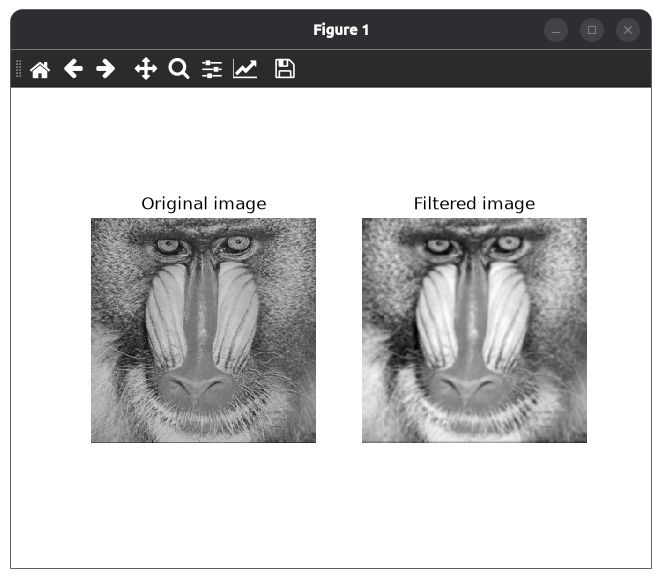

===========================
Filter an image
===========================

Introduction
===========================

Goal
---------------------------

In this tutorial you will learn how to:

- Apply a filter to an image.
- Use the :py:class:`~visp.core.ImageFilter` class.

Prerequisites
---------------------------

You should first read the :ref:`tutorial-image-getting-started` tutorial.

Theory
===========================

Image filtering modifies each pixel of an image using information from its neighboring pixels. Filters are useful for reducing noise, smoothing images, enhancing details, or detecting features such as edges.

A filter uses a small matrix called a kernel or filter window. The kernel moves across the image one pixel at a time. At each position, the values under the kernel are combined to calculate the corresponding output pixel. The filter therefore replaces each pixel with a value based on its local neighborhood. This operation is called a convolution.

For example, Gaussian blur is a smoothing filter that computes each output pixel as a weighted average of nearby pixels. Pixels closer to the center of the kernel receive larger weights, so they have a greater influence on the result. This reduces small intensity variations and noise while preserving the image’s general shapes, resulting in a blurred image.

.. note::

  For more information about image filtering comportement, see the
  `Gaussian blur article <https://en.wikipedia.org/wiki/Gaussian_blur>`_ on
  Wikipedia.

Apply a Gaussian blur filter
============================

Code
---------------------------

The following :ref:`example <code-image-filter>` reads the ``monkey.jpeg``
file as a grayscale image, and applies a Gaussian blur filter:

.. literalinclude:: /examples/image/tutorial-image-filter.py
  :language: python
  :linenos:

You can run the example with:

.. code-block:: bash

  python3 $VISP_WS/visp/modules/python/examples/image/tutorial-image-filter.py

Result
---------------------------

The example displays the blurred image alongside the original image:

Explanation
---------------------------

We first import the classes required to read, convert, and display
images. We also import the :py:class:`~visp.core.ImageFilter` who provides filter methods, like the Gaussian blur function:

.. literalinclude:: /examples/image/tutorial-image-filter.py
  :language: python
  :end-at: from visp.core import ImageFilter

We read the image ``monkey.jpeg`` as a grayscale image:

.. literalinclude:: /examples/image/tutorial-image-filter.py
  :language: python
  :start-at: # Read the image
  :end-at:   sys.exit()

We then create an output image and apply a Gaussian blur with the method :py:meth:`~visp.core.ImageFilter.gaussianBlur`, with a filter size of
``7``, while letting ViSP determine the Gaussian standard
deviation automatically using ``0``:

.. literalinclude:: /examples/image/tutorial-image-filter.py
  :language: python
  :start-at: # Apply a gaussian blur filter to the image
  :end-at: ImageFilter.gaussianBlur(I2, IBlur, 7, 0)

Finally, we display the filtered image as well as the original one:

.. literalinclude:: /examples/image/tutorial-image-filter.py
  :language: python
  :start-at: # Display the two images
  :end-at: plt.show()
