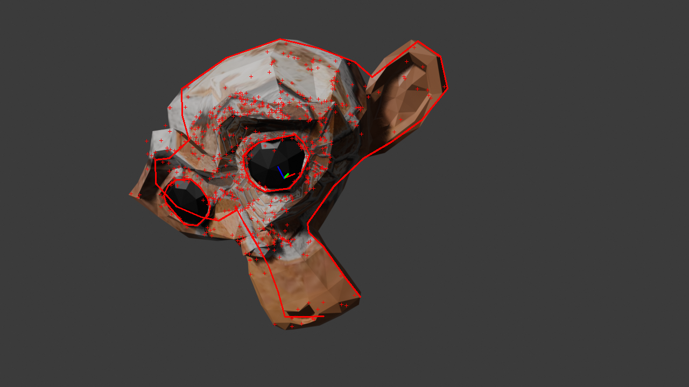
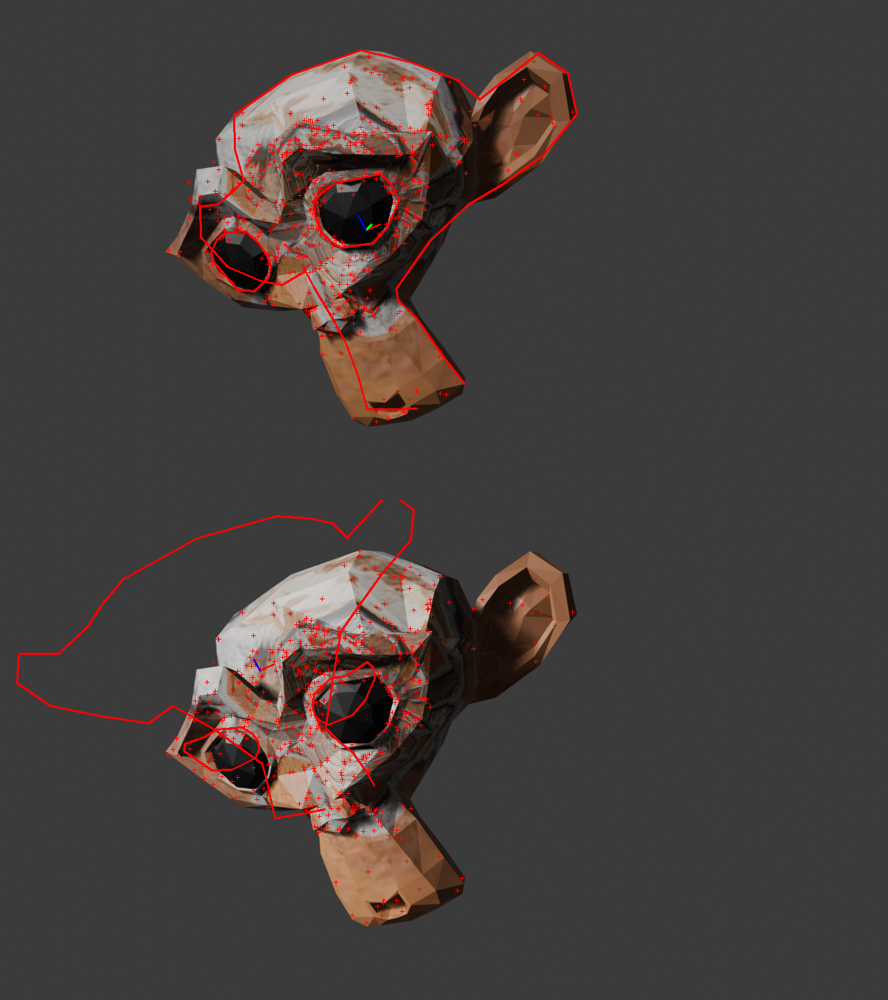

# Blender keypoints extraction: an experimentation

Some tests to use Blender to automatically sample camera viewpoints around an object and to extract SIFT descriptors.

## Install Python OpenCV

Here, Blender is directly installed from an [archive](https://www.blender.org/download/) for Linux platforms.

This has the advantage to be able to use the latest version and not depend on the package manager.
To install OpenCV (`opencv-python`), the following [script](https://github.com/luckychris/install_blender_python_modules) (credit to "luckychris") is used:
- launch Blender from the terminal
- switch to the `Scripting` tab
- open and run the script (use `opencv-python` for the module to be installed)
- in the terminal, info about the installation should be displayed

With this workflow, Python OpenCV is installed locally and directly into the Blender folder.

## Blender scene

For these tests, a simple object is used:
- add the Suzanne model (`Add` > `Mesh` > `Monkey`)
- update the camera focal length and the output resolution

[Triangulate](https://docs.blender.org/manual/en/4.3/modeling/meshes/editing/face/triangulate_faces.html):
- `Edit` mode > `Face` > `Triangulate Faces` (`Ctrl T`)

For the texturing:
- `Material` > `New` > `Base Color` > `Image Texture`
- here [`Unwrap`](https://docs.blender.org/manual/en/4.3/modeling/meshes/editing/uv.html) is used
- `UV Editing` window > Open the image
- move to center the mesh

## Run the keypoints extraction script

Switch to the `Scripting` window, open and run the [`extract_sift_sampling_Suzanne.py`](extract_sift_sampling_Suzanne.py) script.

The main principles are:
- sample equidistant camera poses around the object
- run SIFT detector and for each feature:
  - perform [back-face culling](https://en.wikipedia.org/wiki/Back-face_culling) for visibility test
  - compute [ray-triangle intersection](https://docs.blender.org/api/4.3/mathutils.geometry.html#mathutils.geometry.intersect_ray_tri) to get the 3D coordinates and transform to the object frame
  - save the list of detected features (SIFT descriptors + 3D object coordinates) into a `.npz` file format

## Render a test image

Move the camera, the light at the desired positions and use the [`render_still_image_Suzanne.py`](render_still_image_Suzanne.py) script to conveniently render the image and save the camera pose.

## Keypoints matching and pose computation

Use the [`keypoints_matching_Suzanne.py`](keypoints_matching_Suzanne.py) script.

## Results

### Keypoints matching

A brief overview of the keypoints matching process can be seen:


Matching lines are those from the keypoints matching process, RANSAC results are not displayed.

### Pose computation

Running the script should give result similar to:

```bash
rvec=[[ 1.83592335 -0.06509804 -0.60995061]]
rvec_gt=[[ 1.83833405 -0.06378919 -0.60991766]]

c_T_o_est:
[[ 0.86373993  0.25108214 -0.43693374 -0.4630725 ]
 [-0.33764126 -0.35531447 -0.8716364  -0.11690215]
 [-0.37410121  0.90039402 -0.2221236   5.08996118]
 [ 0.          0.          0.          1.        ]]
c_T_o_gt:
[[ 0.86392033  0.25132278 -0.4364382  -0.46306577]
 [-0.33618754 -0.35746148 -0.87132031 -0.11758688]
 [-0.37499252  0.89947647 -0.22432667  5.09212732]
 [ 0.          0.          0.          1.        ]]

```

Result with a rough simplified model should give:



### Illumination change test

Same camera viewpoint but with a different illumination condition:

```bash
rvec=[[ 2.3786033  -0.60075198 -0.0076497 ]]
rvec_gt=[[ 1.83833405 -0.06378919 -0.60991766]]

c_T_o_est:
[[ 0.89370737 -0.41880363 -0.16090572 -1.16669042]
 [-0.42276497 -0.66606072 -0.61451842 -0.50213294]
 [ 0.15018957  0.61722495 -0.77231888  5.45509487]
 [ 0.          0.          0.          1.        ]]
c_T_o_gt:
[[ 0.86392033  0.25132278 -0.4364382  -0.46306577]
 [-0.33618754 -0.35746148 -0.87132031 -0.11758688]
 [-0.37499252  0.89947647 -0.22432667  5.09212732]
 [ 0.          0.          0.          1.        ]]
```


