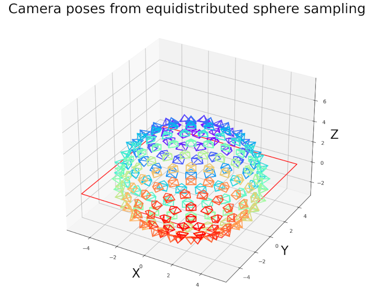

# Useful scripts

This folder contains scripts that may help ViSP user and developer.

## PerfCompare.py

Python script useful to compare benchmark performances before and after a potential source code modification/optimization or to compare performances using different third-party libraries.

For example in `$VISP_WS/visp-build/module/core` let us consider the `perfMatrixMultiplication` binary.

Depending on your python installation you may install support for enumerations:

```console
$ pip install enum
```

This script works like this:

- run first the performance binary activating benchmark and xml output options:

    ```console
    $ cd $VISP_WS/visp-build/module/core
    $ ./perfMatrixMultiplication --benchmark --reporter xml --out /tmp/log_perfMatrixMultiplication_MKL.xml
    $ ./perfMatrixMultiplication --benchmark --reporter xml --out /tmp/log_perfMatrixMultiplication_OpenBLAS.xml
    ```

- Use the script to compare performances:

    ```console
    $ cd $VISP_WS/visp/script
    $ python PerfCompare.py --before /tmp/log_perfMatrixMultiplication_OpenBLAS.xml \
                            --after /tmp/log_perfMatrixMultiplication_MKL.xml       \
                            --before-label OpenBLAS --after-label MKL
    ```

## create_module.py

This script allows to create the structure of a new ViSP module as explained in this [tutorial](https://visp-doc.inria.fr/doxygen/visp-daily/tutorial-contrib-module.html).

## format-coding-style.sh

This script uses `clang-format` to format ViSP source code. It should be used carefully since a lot of file could be affected.

- To install `clang-format`:

    - On Ubuntu like OS:

        ```console
        $ sudo apt-get install clang-format
        ```
    - On OSX:

        ```console
        $ brew install clang-format
        ```

- To run this script:

    ```console
    $ cd $VISP_WS/visp/script
    $ sh format-coding-style.sh
    ```

- To format a single file with extension `*.h` or `*.cpp`, you may rather run:

    ```console
    $ cd $VISP_WS/visp
    $ clang-format -i <path to file.[h,cpp]>
    ```

## make-coverage-report.sh

Script that runs the same coverage pipeline as the GitHub CI and generates an HTML report in the build folder. This makes it easier to have an up to date coverage when writing tests locally.

The script is working for Ubuntu and needs `lcov` tool.

- To install `lcov` on Ubuntu like OS:

  ```console
  $ sudo apt-get install lcov gcovr
  ```

- To run the script

  ```console
  $ cd $VISP_WS
  $ git clone https://github.com/lagadic/visp
  $ ./visp/script/make-coverage-report.sh visp-build
  ```

- Results are available in `visp-build/coverage/index.html`.

## LonLatCamPosesVisualizer.py

This Python script allows displaying camera poses sampled from longitude / latitude coordinates and using a method for regularly sampled points on a sphere.

Example (use the help option `-h` to display the available parameters):

```console
python3 LonLatCamPosesVisualizer.py --full-sphere
```

Following image shows camera poses equidistributed sampled on a sphere:



## Blender/look_at.py

This Python script can be used in a Blender scene and contains example code for:

- camera look-at function, to automatically point the camera toward a specific object,
- retrieving the camera pose with respect to another Blender object,
- and save camera images in a `/tmp/` directory.

To test this script:

- on Ubuntu/Linux launch Blender from a Terminal and use the default scene,
- switch to the [Text Editor](https://docs.blender.org/manual/en/dev/editors/text_editor.html) and open the Python script,
- when running the script, you should see the corresponding camera poses outputed on the terminal.

## PlotCameraTrajectory.py

This Python script allows displaying camera poses along with the object of interest.

Camera poses can be saved in `4x4` homogeneous matrix form or in `1x6` pose vector form (`[tx, ty, tz, tux, tuy, tuz]`), C++ example code using the homogeneous matrix format:

```cpp
std::ofstream file_pose("poses.txt", std::ios_base::app);
if (file_pose.is_open()) {
  for (unsigned int i = 0; i < 4; i++) {
    for (unsigned int j = 0; j < 4; j++) {
      file_pose << c1Mo[i][j] << " ";
    }
    file_pose << std::endl;
  }
}
```

Script example (use the help option `-h` to display the available parameters):

```console
python3 PlotCameraTrajectory.py -p poses.txt -m cube_and_cylinder.cao --azim -118 --elev 48 --x-lim -0.384455412421155 0.336083836255455 --y-lim -0.595371140756035 0.12516810792057498 --z-lim -0.12739950848021997 0.59313974019639 --num-cam 4 --save --save-pattern 'image_{:04d}.png' --frame-size 0.1
```

Following video shows the camera poses outputed by the ViSP model-based tracker when tracking the cube+cylinder object model:

[](https://user-images.githubusercontent.com/8035162/180662750-02fccaff-74bd-411c-8258-06910edc6fde.mp4 "Cube+cylinder tracking using ViSP MBT")

## PlotRGBIrDepthData.py

This Python script allows displaying RGB/Infrared/Depth/Pointcloud data saved using the example/device/framegrabber/saveRealSenseData.cpp sample.
It contains sample code to learn how to manipulate NumPy NPZ format, such as multi-dimensional array and display them with Matplotlib.

Simply run the following command with the correct folder path:


```console
python3 PlotRGBIrDepthData.py -i <folder>
```
